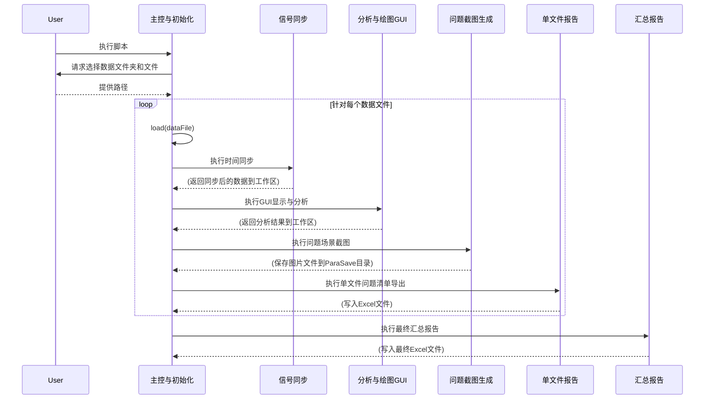

# 项目代码工程深度分析文档

## 1. 项目整体描述

### 1.1 问题背景
本项目是一个用于对Gen3摄像头LKAS OFF功能进行数据分析和评估的MATLAB工程。其核心业务目标是：处理从车辆（通过MF4或MAT文件格式）采集的原始数据，通过一系列的计算和分析，最终生成一份关于LKAS（车道保持辅助系统）关闭场景下的“问题清单”和汇总报告。项目旨在自动化数据处理、同步、可视化、问题检测和报告生成的整个流程，以提高分析效率和准确性。

### 1.2 功能模块概览
基于对整个工程的深度分析，项目可以被划分为以下五个核心功能模块：

1.  **主控与初始化模块 (`main.m`)**: 作为整个项目的入口和调度中心，负责设置环境、获取用户输入（数据路径等）、并以文件为单位循环调用其他处理模块。
2.  **信号处理与时间同步模块 (`signalsTimeSync.m`)**: 负责解决不同传感器或数据记录器之间数据采样率不一致的问题。它将所有信号重采样，对齐到统一的时间基准上，是后续所有分析计算的数据基础。
3.  **核心数据分析与绘图模块 (`ViewerMF4_FromMF4ConvertedDataFrazki.m`)**: 一个功能强大的交互式GUI模块，用于深度可视化和分析数据。它提供了一个包含鸟瞰图和数十个时序图的复杂界面，允许分析人员交互式地审查数据细节。
4.  **问题场景截图生成模块 (`CreateParapra.m`)**: 负责在检测到特定“问题”事件时，自动生成并保存包含所有关键信号状态的详细绘图快照。
5.  **报告与结果导出模块 (`ExportToExcel.m`, `export_excel.m`)**: 负责将分析结果持久化。它包含两个子功能：在循环中检测并导出每个文件的详细“问题清单”到Excel；在流程结束后，汇总所有清单，生成一个最终的摘要报告。

---

## 2. 功能模块详细设计

### 2.1 主控与初始化模块
#### 2.1.1 模块说明
此模块作为项目的主入口和流程控制器。它首先通过对话框获取用户指定的数据目录和文件，然后遍历所有`*_ACore_XCP_remap.mat`格式的数据文件，并为每个文件依次调用数据同步、视图生成、参数创建和Excel导出等子处理模块。

#### 2.1.2 重点逻辑
1.  **初始化与用户输入**: 清理环境并通过`uigetdir`, `uigetfile`等函数获取数据文件夹、`mf4_info.m`文件路径以及软件版本号。
2.  **视频时长计算**: 搜索`*.avi`文件并计算最大视频时长，用于后续的时间间隔设定。
3.  **主循环处理**: 核心部分是一个for循环，遍历指定目录下的所有`*_ACore_XCP_remap.mat`文件。
4.  **顺序调用子模块**: 在循环内部，按顺序执行`signalsTimeSync`, `ViewerMF4_FromMF4ConvertedDataFrazki`, `ExportToExcel`, `CreateParapra`等脚本。
5.  **内存管理**: 在每次循环结束时，使用`clearvars -except ...`命令清理内存，防止不同数据文件间的变量干扰。
6.  **最终导出**: 循环结束后，调用`export_excel`脚本生成最终的报告。

#### 2.1.3 模块内部交互
`main.m`本身是一个线性的脚本，不包含内部函数定义。其主要交互方式是通过`load`加载数据文件，然后将加载到工作空间（Workspace）的数据作为输入，依次传递给其他子功能脚本。这种方式使得模块间的耦合度较低，但依赖于共享的MATLAB工作空间。

#### 2.1.4 关键伪代码
```matlab
% 1. 初始化环境
clear all;

% 2. 获取用户输入路径和版本信息
dataFolder = select_folder("请选择 mat_data 文件夹");
blf_dataFolder = select_folder("请选择 blf_data 文件夹");
mf4_info_file = select_file("请选择 mf4_info.mat 文件");
soft_ver = input("请输入软件版本");

% 3. 查找所有待处理的数据文件
data_files = find_files(dataFolder, "*_ACore_XCP_remap.mat");

% 4. 遍历处理每个数据文件
for each file in data_files
    % 加载数据到工作区
    load(file);

    % 依次调用处理脚本
    run('signalsTimeSync.m');
    run('ViewerMF4_FromMF4ConvertedDataFrazki.m');
    run('ExportToExcel.m');
    run('CreateParapra.m');

    % 清理工作区，为下一次迭代做准备
    clear_workspace_variables_for_next_loop();
end

% 5. 执行最终的导出逻辑
run('export_excel.m');
```

### 2.2 信号处理与时间同步模块
#### 2.2.1 模块说明
该模块负责将不同采样率的信号组（Group2, Group3）与基准时间轴（`Group1Time`）进行对齐。它通过查找和映射索引，将原始信号数据重采样到统一的时间基准上，为后续的分析和计算提供同步的数据基础。

#### 2.2.2 重点逻辑
1.  **基准时间**: 选取`Group1Time`作为所有信号同步的基准时间向量。
2.  **索引映射 (Time Sync)**: 核心算法是两个嵌套的for循环。外层循环遍历基准时间`Group1Time`的每个点，内层循环在目标信号组的时间向量（如`Group3Time`）中找到一个时间窗`[t_j-1, t_j]`，使得`Group1Time`的当前时间点落入这个窗内。然后记录下索引`j`。
3.  **重采样**: 利用上一步生成的索引向量（`G3_indices`, `G2_indices`），从原始的、未对齐的信号数据（如`saTldMiBusOut_...`结构体中的`signals.values`）中提取出新的、与`Group1Time`对齐的信号矩阵。
4.  **错误处理与填充**: 如果某个基准时间点找不到对应的索引（即`G3_indices`中出现0），则将其标记为错误索引`indexERR`，并将该位置的数据统一置为0。这是一种简单的数据填充/清洗策略。
5.  **变量覆盖**: 脚本最后将重采样并清洗过的新信号矩阵，覆盖回MATLAB工作空间中原有的`...log`结构体中，供后续脚本使用。

#### 2.2.3 模块内部交互
此脚本不调用任何其他函数或脚本。它完全依赖于`main.m`加载到MATLAB工作空间的数据。其内部逻辑分为两大块，分别处理`Group3`和`Group2`的同步，两块逻辑几乎完全相同，只是处理的信号变量不同。

#### 2.2.4 关键伪代码
```matlab
% 设定基准时间
base_time = Group1Time;

% --- 同步Group3信号 ---
% 1. 查找时间戳匹配的索引
G3_indices = [];
for i = 1:length(base_time)
    for j = 2:length(Group3Time)
        if base_time(i) > Group3Time(j-1) && base_time(i) <= Group3Time(j)
            G3_indices(i) = j;
            break;
        end
    end
end

% 2. 处理未匹配的索引
error_indices = find(G3_indices == 0);
G3_indices(error_indices) = 1; % 使用第一个索引填充，避免程序出错

% 3. 根据索引重采样所有Group3的信号
lmVecMapLnPntX_synced = saTldMiBusOut_...lmVecMapLnPntX.signals.values(G3_indices,:);
% ... (对几十个信号执行相同操作)

% 4. 将错误索引位置的数据置零
lmVecMapLnPntX_synced(error_indices,:) = 0;
% ... (对所有同步后的信号执行相同操作)

% 5. 将同步后的数据写回工作区
saTldMiBusOut_...lmVecMapLnPntX.signals.values = lmVecMapLnPntX_synced;
% ... (覆盖所有相关信号)


% --- 同步Group2信号 (重复以上1-5步的逻辑) ---
G2_indices = find_corresponding_indices(base_time, Group2Time);
% ... (后续逻辑与Group3完全一致)
```

### 2.3 核心数据分析与绘图模块
#### 2.3.1 模块说明
此模块是一个集数据可视化、交互式分析和部分数据处理于一体的核心组件。它通过编程方式构建一个复杂的MATLAB GUI窗口，其中包含一个主鸟瞰图（BEV）和数十个同步的时间序列子图。用户可以通过时间滑块、复选框和按钮与数据进行深度交互，以审查不同信号的状态和关系，并能触发视频生成等功能。

#### 2.3.2 重点逻辑
1.  **GUI构建**: 脚本的核心功能是创建一个拥有复杂布局的`figure`对象。它使用`uicontrol`和`subplot`命令，以代码的方式添加了大量控件，包括：
    *   一个用于在时间轴上“拖动”查看数据的主**滑块** (`slider_obj`)。
    *   多个**复选框**，用于在鸟瞰图上动态显示或隐藏不同的数据层（如地图线、相机线、物体等）。
    *   一个**跳转按钮**，允许用户直接输入时间点进行跳转。
    *   一个**保存按钮**，用于触发鸟瞰图的视频录制功能。
    *   数十个**子图（subplot）**，用于并列展示各种关键信号的时间序列图。
2.  **多图表数据可视化**: 脚本从工作区中已经同步好的信号（如`saTldMiBusOut_...`）提取数据，并进行计算和绘制。
    *   **主鸟瞰图(BEV)**: 位于中心的大图(`ax1`)，用于绘制车辆环境的俯视图，是各种车道线、车辆位置等空间信息的载体。
    *   **海量时序图**: 围绕主图，绘制了数十个小图，每个图表都展示一个或多个特定信号随时间的变化，例如车速、曲率、车道线质量、系统状态标志位等。
3.  **嵌入式数据分析**: 在绘图之前，脚本内部执行了大量的即时数据处理。
    *   **状态解码**: 大量使用`bitget`函数从整数形式的状态变量中提取单个比特位，以判断各种子功能的开关状态。
    *   **计算衍生信号**: 例如，根据X、Y方向速度计算实际车速`egoSpd`。
    *   **调用分析函数**: `calcTldMiBusOut_...`函数被调用来计算不同车道线模型之间的横向差异，这是评估算法性能的关键指标。
4.  **交互逻辑 (Callbacks)**: 脚本的后半部分定义了多个本地函数，用于响应用户的GUI操作。
    *   `viewerMF4_callback`: 响应时间滑块的操作，理论上应根据滑块位置更新所有图表，但实现该功能的关键代码`evalin("base", "paraviewer_onlyMF4_d2_replot")`被注释掉了。
    *   `jumpbutton`: 实现时间点跳转功能。
    *   `generate_video`: 弹出对话框，获取用户设置并生成视频。

#### 2.3.3 模块内部交互
*   **依赖关系**: 脚本在开始时调用`SignalsSetting`进行初始化。其核心功能严重依赖一个名为`paraviewer_onlyMF4_d2_replot`的外部脚本或函数来刷新绘图，但此调用已被注释。
*   **代码重复**: 脚本内部直接包含了一个名为`calcTgtDiffy`的复杂函数，此函数内部又似乎粘贴了`accuracyVerif.m`和`makeC0Trace.m`等文件的逻辑。这表明`AnalysisExcel/subFunc`和`PlotLoc/subFunc`目录下的文件与此模块有很强的逻辑关联性，但通过“复制-粘贴”的方式集成，而非函数调用。
*   **工作区交互**: 大量使用`evalin`和`assignin`在GUI回调函数和MATLAB基础工作空间之间传递变量。这是旧式MATLAB GUI编程的常见做法，但会使数据流向变得模糊且脆弱。

#### 2.3.4 问题点抽取
1.  **巨石结构 (Monolithic)**: 将GUI定义、数据处理、绘图和回调逻辑全部写在一个超过2200行的文件里，使得代码极难阅读、维护和扩展。
2.  **核心功能缺失**: 最关键的“交互式更新绘图”功能因`replot`脚本的调用被注释而失效。这使得GUI失去了动态交互的能力。
3.  **代码冗余与坏味道**: 直接将其他文件的代码复制粘贴到此脚本中，是软件工程中的严重坏味道。一旦原始逻辑需要修改，必须同时维护多个副本。
4.  **脆弱的GUI实现**: 过度依赖`evalin`/`assignin`使得代码耦合性高，且难以调试。

### 2.4 问题场景截图生成模块 (`CreateParapra.m`)
#### 2.4.1 模块说明
此模块的核心功能是自动化地为分析过程中检测到的特定“问题事件”生成详细的图形快照。它不创建交互式GUI，而是直接在后台生成一系列包含完整数据视图的图像文件，并根据问题类型将它们分类存储。

#### 2.4.2 重点逻辑 - 事件检测与分类的详细阐述
此部分是模块的核心决策逻辑，负责从海量的时间序列数据中精确地识别出需要被分析的“问题场景”，并为每个场景打上分类标签。整个过程分为两步：

1.  **事件检测 (Event Detection)**:
    此步骤通过一个复杂的复合逻辑条件，在所有时间点上进行扫描，以找出满足特定“问题”定义的时间点索引。这个检测条件与`ExportToExcel.m`中的逻辑高度一致，其本质是寻找一个系统状态组合，该组合意味着LKAS功能可能出现问题的临界状态。具体来说，它要求**系统处于激活状态**，**但同时主车道线（Ego Lane）丢失**，并且**至少有一条控制车道线是存在的**。这个组合精确地描述了“系统本应工作，但关键输入（主车道线）却丢失了”的典型问题场景。

2.  **事件分类 (Event Classification)**:
    在检测到问题时间点后，系统会进入分类逻辑。分类的目的是为了进一步细化问题的原因或表现。它通过检查该时间点上更详细的内部状态标志位来完成。具体来说，它会检查**PLD（Plausibility）模块的状态 (`lmPldStt`)** 和 **车道线控制模式 (`lmCtrlLnMode`)** 的具体比特位。例如：
    *   **CA/CB/CC/CD/CE 类**: 这些分类通常对应PLD模块检测到的特定类型的车道线数据冲突或不可靠情况。例如，`bitget(lmPldStt, 1)` 可能代表“左侧车道线数据不可靠”，而 `bitget(lmPldStt, 2)` 可能代表“右侧车道线数据不可靠”。通过组合这些标志位，可以将问题归因于左侧、右侧或两侧同时出现的具体问题。
    *   **Other 类**: 如果一个问题时间点不满足任何预设的详细分类条件，它就会被归入“Other”类别，作为一个通用的、待进一步分析的事件。

这种“先检测，再分类”的策略，使得分析过程既能高效地从全局数据中筛选出所有潜在问题，又能对每个问题进行深度诊断和归因，极大地提升了自动化分析的效率和准确性。

#### 2.4.3 模块内部交互
*   **无外部调用**: 此脚本是自包含的，不调用其他M文件。
*   **依赖工作区**: 它完全依赖由`main.m`加载并由`signalsTimeSync.m`处理过的MATLAB工作区变量。
*   **与`ViewerMF4`模块的关系**: 该模块可以被看作是`ViewerMF4_...`模块的“非交互式”版本。它复用了后者的绘图代码，目的是将后者的可视化能力用于批量化、自动化的出图任务，而非人工交互分析。这种实现方式导致了严重的代码冗余。

#### 2.4.4 关键MATLAB伪代码输出
```matlab
% --- 事件检测与分类逻辑 ---

% 1. 事件检测
% 目标: 找出所有满足“系统激活但主车道线丢失”条件的时间点索引。
% 这是整个问题发现过程的入口。

% 核心源码: 使用 find 函数和复杂的逻辑条件直接找出所有问题索引
index = find(...
    bitget(smVecSysActivateMode.signals.values,1) == 1 & ... % 条件1: 系统激活 (System Activate Mode bit 0 is 1)
    eMap.signals.values(:,1) == 0 & ...                     % 条件2: 主车道线丢失 (eMap value is 0)
    ( ...
        (lmPldStt.signals.values(:,1) >= 1 & lmPldStt.signals.values(:,1) <= 4) | ... % 条件3.1: PLD状态为 1-4
        (lmPldStt.signals.values(:,1) >= 17 & lmPldStt.signals.values(:,1) <= 20)   % 条件3.2: 或 PLD状态为 17-20
    ) & ...
    lmVecCtrlLnExistFlg.signals.values(:,1) == 1 ...         % 条件4: 控制车道线存在 (Control Lane Exists Flag is 1)
);

% 伪代码: 对检测到的索引进行初步处理
% (例如，为了避免事件过于密集，可以进行去重或筛选)
processed_indices = process_indices(index); % 例如：移除时间上过于接近的事件点


% 2. 事件分类
% 目标: 遍历所有检测到的问题点，根据更详细的状态位将其归入不同类别。

% 伪代码: 初始化一个用于存储分类结果的容器
classification_results = cell(length(processed_indices), 1);

% 核心源码: 遍历每个问题索引，并使用 if/elseif/else 结构进行分类
for i = 1 : length(processed_indices)
    % 获取当前事件点的时间索引
    currentIndex = processed_indices(i);

    % 提取当前时刻的 PLD 状态和车道线控制模式
    pld_status = lmPldStt.signals.values(currentIndex, 1);
    ctrl_mode = lmCtrlLnMode.signals.values(currentIndex, 1);

    % 根据 PLD 状态和控制模式的比特位进行精确分类
    if (bitget(pld_status,1) && bitget(pld_status,2)) % PLD bit 0 和 bit 1 都为1
        classification_results{i} = 'CA';
    elseif (bitget(pld_status,1) && bitget(pld_status,3)) % PLD bit 0 和 bit 2 都为1
        classification_results{i} = 'CB';
    elseif (bitget(pld_status,5) && bitget(pld_status,6)) % PLD bit 4 和 bit 5 都为1
        classification_results{i} = 'CC';
    elseif (bitget(pld_status,5) && bitget(pld_status,7)) % PLD bit 4 和 bit 6 都为1
        classification_results{i} = 'CD';
    elseif (bitget(ctrl_mode,1) || bitget(ctrl_mode,2)) % 控制模式 bit 0 或 bit 1 为1
        classification_results{i} = 'CE';
    else
        % 如果不符合以上任何一种情况，则归为"其他"
        classification_results{i} = 'Other';
    end
end

% 后续处理...
% 伪代码: 根据分类结果 (classification_results) 创建对应的文件夹，
%         并调用绘图函数，为每个事件生成并保存图像。
for i = 1 : length(processed_indices)
    create_directory_for_event(classification_results{i});
    generate_and_save_plot(processed_indices(i), classification_results{i});
end
```

### 2.5 报告与结果导出模块

#### 2.5.1 模块说明
该模块负责将分析结果结构化地导出到外部文件。它主要由两部分组成：
1.  **循环内事件导出 (`ExportToExcel.m`)**: 在处理每个数据文件时，检测并分类特定的“问题”事件，并将详细信息追加写入一个按天汇总的Excel工作表中。
2.  **循环外摘要导出 (`export_excel.m`)**: 在所有文件处理完毕后，生成一个全局的摘要Excel文件。

---

### Part 1: 循环内事件导出 (`ExportToExcel.m`)

#### 模块说明
此脚本是报告生成模块的第一部分，在主循环中为每个被处理的数据文件执行一次。它的核心功能是：通过COM接口与Microsoft Excel进行交互，检测预先定义的多种“问题”或“事件”组合，对这些事件进行分类，然后将事件的关键信息（如时间、速度、类型、对应的MF4文件名等）追加写入一个按日期命名的Excel文件中。

#### 重点逻辑
1.  **Excel自动化 (COM Interface)**: 脚本通过`actxserver('Excel.Application')`启动并控制一个Excel进程。这使其能够动态地创建、打开、写入和保存Excel文件。**这也导致该脚本只能在安装了Excel的Windows环境下运行。**
2.  **文件追加写入**: 脚本会检查当天日期的Excel文件（例如`20230101_LKASOFF.xlsx`）是否存在。如果存在，则打开该文件并定位到最后一个空列，准备追加新数据；如果不存在，则创建一个新的Excel工作簿。这种设计使得一天内处理的所有数据文件的结果可以被汇总到同一个Excel文件的不同列中。
3.  **事件检测与索引**: 脚本的核心是一个循环，遍历所有时间点，并检查一个复杂的复合条件。该条件由多个信号的特定状态（主要是`eMap`, `lmPldStt`, `lmVecCtrlLnExistFlg`, `smVecSysActivateMode`等信号的特定比特位）组合而成，用于精确地找出需要关注的“问题”时间点，并记录其索引。
4.  **事件分类**: 在找到所有问题时间点的索引后，脚本会进一步根据其他信号的状态，将每个问题事件分类为'パターンA', 'パターンB', 'パターンDEF'等不同类型。
5.  **信息整合与写入**: 对于每个被分类的事件，脚本会构建一个由`#`分隔的字符串，该字符串包含了车速、事件分类、一个推断的截图文件名（如`time_123.45[sec].png`）以及对应的原始MF4文件名。这个整合后的字符串被写入到Excel表格的单元格中。
6.  **保存与退出**: 完成所有事件的写入后，保存Excel工作簿并关闭Excel进程。

---

### Part 2: 循环外摘要导出 (`export_excel.m`)

#### 模块说明
此脚本是报告生成模块的第二部分，也是整个分析流程的收尾步骤。它运行在所有数据文件处理完成之后，负责扫描由`ExportToExcel.m`生成的每日“问题清单”Excel文件，并从中提取、汇总信息，最终生成一个带有时间戳的、全局性的摘要Excel报告。

#### 重点逻辑
1.  **扫描中间文件**: 脚本首先会查找`issueList`目录下所有由`ExportToExcel.m`生成的`.xlsx`结果文件。
2.  **创建汇总工作簿**: 通过`actxserver`创建一个新的、空白的Excel工作簿，用于存放最终的汇总信息。
3.  **循环与聚合**: 脚本的核心是一个双重循环。外层循环遍历每个找到的每日问题清单文件（如`20230101_LKASOFF.xlsx`）。内层循环则遍历该文件中的每一列（因为每一列代表一个原始数据文件的分析结果）。
4.  **统计问题类型**: 在内层循环中，脚本会读取整列的数据，并通过字符串查找（`contains`）来统计'パターンA', 'パターンB'等各类问题的出现次数。
5.  **写入汇总信息**: 对于每个原始数据文件（即每日问题清单中的每一列），脚本会在汇总报告中写入新的一行。该行包含了：
    *   指向每日问题清单文件的**超链接**。
    *   原始数据文件的名称。
    *   在`main.m`中输入的软件版本号。
    *   该文件中各类问题的统计总数。
6.  **格式化与保存**: 在所有数据都汇总完毕后，脚本会自动调整汇总报告的列宽，并以`[LKASOFF]カメラLKASOFF解析Summary_[日期].xlsx`的格式保存，最终关闭Excel进程。

---

## 3. 模块间调用关系

此工程的调用关系以`main.m`为核心，呈现出清晰的顺序批处理流程。各个模块之间通过共享MATLAB工作区（Workspace）的方式传递数据，耦合度较低。



## 4. 代码读取与分析

本次分析严格遵循了预设的流程。通过文件系统工具（`list_directory`）和`matlab_recursive_analyze`工具的初步输出来识别关键文件和目录，例如`main.m`入口、`AnalysisExcel`和`PlotLoc`等功能目录。

对于核心脚本，特别是像`ViewerMF4_FromMF4ConvertedDataFrazki.m`和`CreateParapra.m`这样包含大量重复绘图逻辑的长文件，使用了`read_file`工具进行完整读取。这对于理解模块功能和发现代码冗余至关重要。分析过程中，将每个模块的分析结果（模块说明、重点逻辑、伪代码等）先独立完成，再进行最终的整合，保证了分析的结构化和条理性。

## 5. 工具使用说明

在本次分析中，`matlab_recursive_analyze`工具起到了关键的引导作用。在分析初期，通过以`main.m`为入口执行该工具，我们获得了项目顶层脚本之间最直接的调用链路（`main.m` -> `signalsTimeSync.m`, `main.m` -> `ExportToExcel.m`）。

虽然工具因为脚本通过共享工作区变量、而非直接函数调用的方式进行交互，未能展示出所有深层联系（例如`main.m`实际还调用了`ViewerMF4...`和`CreateParapra`），但它提供的初始链路信息帮助我们快速锁定了`main.m`作为分析起点，并识别出`signalsTimeSync.m`和`ExportToExcel.m`是两个需要被关注的核心功能，从而有效地规划了后续的逐层深入分析（Triage）顺序。


## 6. 总结与建议

### 6.1 优点
*   **流程自动化**: 项目成功地将数据加载、同步、分析、问题检测和报告生成的多个步骤串联起来，实现了高度的批处理自动化。
*   **功能完整**: 覆盖了从原始数据到最终汇总报告的完整分析流程，功能模块划分相对清晰。
*   **强大的可视化**: `ViewerMF4_...`模块提供了极为丰富和详细的数据可视化界面，对于深度分析特定问题场景非常有帮助。
*   **结果结构化**: 通过`CreateParapra.m`和`ExportToExcel.m`，将分析结果（图片、数据）结构化地保存，便于回顾和追溯。

### 6.2 待改进点
1.  **代码质量与可维护性**:
    *   **代码冗余**: `CreateParapra.m`中的绘图逻辑几乎完全复制自`ViewerMF4_...`。这是最需要解决的问题。应将这部分共享的绘图代码提取到一个独立的函数中，由两个脚本共同调用。这将极大减少代码量并简化未来的维护工作。
    *   **巨石脚本**: `ViewerMF4_...`脚本是典型的“巨石”代码，应将其中的GUI布局、数据处理、绘图逻辑和回调函数拆分为独立的、可复用的函数或类。
    *   **硬编码与魔法数字**: 代码中存在大量硬编码的路径、文件名和“魔法数字”（如直接在代码中使用的数组索引、比特位位置等），应将它们定义为常量或配置参数。
2.  **GUI交互性**: `ViewerMF4_...`中关键的绘图更新回调被注释，导致GUI失去了核心的交互能力。应修复此问题，并考虑使用更现代的MATLAB App Designer来构建GUI，以获得更健壮、更易于维护的代码。
3.  **跨平台兼容性**: `ExportToExcel.m`和`export_excel.m`使用`actxserver`，这使得项目强依赖于Windows和Microsoft Excel。应考虑使用`writetable`等MATLAB内建函数来生成`.csv`或`.xlsx`文件，以实现跨平台兼容。
4.  **数据传递方式**: 模块间完全依赖共享工作区传递数据，这种方式虽然简单，但在大型项目中容易导致变量名冲突和不可预见的副作用。可以考虑将数据封装在结构体或对象中进行传递，或者将整个流程封装在一个或多个类中。
5.  **错误处理**: 项目中缺少完善的错误处理机制。例如，在`signalsTimeSync.m`中，对于无法同步的时间点仅做了简单的置零处理，这可能会掩盖潜在的数据问题。应引入更明确的错误提示和日志记录。