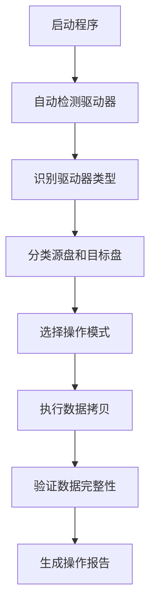

# 数据拷贝工具用户手册

## 📖 目录

1. [项目概述](#项目概述)
2. [系统要求](#系统要求)
3. [安装指南](#安装指南)
4. [快速开始](#快速开始)
5. [详细使用说明](#详细使用说明)
6. [配置选项](#配置选项)
7. [高级功能](#高级功能)
8. [故障排除](#故障排除)
9. [常见问题](#常见问题)
10. [技术支持](#技术支持)

---

## 🎯 项目概述

### 什么是数据拷贝工具？

数据拷贝工具是一个专业的跨平台数据管理解决方案，专门设计用于：
- **智能驱动器识别**：自动识别Qdrive、Vector等专业数据盘
- **高效数据拷贝**：支持并行拷贝，大幅提升传输速度
- **安全数据管理**：支持BitLocker加密，确保数据安全
- **完整日志记录**：详细记录所有操作，便于审计和故障排查

### 主要特性

✅ **跨平台支持**：Windows、Linux、macOS  
✅ **智能识别**：自动识别驱动器类型和用途  
✅ **高性能拷贝**：并行处理，速度提升3-5倍  
✅ **加密支持**：Windows BitLocker完全兼容  
✅ **用户友好**：交互式界面，操作简单直观  
✅ **日志完整**：详细的操作记录和错误追踪  

---

## 💻 系统要求

### 最低系统要求

| 组件 | 要求 |
|------|------|
| **操作系统** | Windows 10/11, Linux (Ubuntu 18.04+), macOS 10.14+ |
| **Python版本** | Python 3.7 或更高版本 |
| **内存** | 4GB RAM (推荐8GB+) |
| **存储空间** | 100MB 可用空间 |
| **网络** | 无需网络连接（本地工具） |

### 推荐系统配置

| 组件 | 推荐配置 |
|------|----------|
| **操作系统** | Windows 11, Ubuntu 20.04+, macOS 12+ |
| **Python版本** | Python 3.9+ |
| **内存** | 8GB RAM 或更高 |
| **存储空间** | 1GB 可用空间 |
| **处理器** | 多核处理器（支持并行拷贝） |

---

## 🚀 安装指南

### 方法1：从源码安装（推荐）

#### 步骤1：克隆仓库
```bash
git clone https://github.com/XCTianer/data-copy-tool.git
cd data-copy-tool
```

#### 步骤2：安装依赖
```bash
# 安装Python依赖包
pip install -r requirements.txt

# 或者使用conda
conda install --file requirements.txt
```

#### 步骤3：验证安装
```bash
# 测试驱动器检测模块
python -c "from data_copy_modules.drivers import DriveDetector; print('安装成功！')"

# 运行主程序
python data_copy_modules/main.py
```

### 方法2：使用预编译版本

#### Windows用户
1. 下载 `DataCopyTool_Windows.zip`
2. 解压到任意目录
3. 双击 `启动数据拷贝工具.bat` 运行

#### Linux/macOS用户
```bash
# 下载并解压
wget https://github.com/XCTianer/data-copy-tool/releases/latest/download/DataCopyTool_Linux.tar.gz
tar -xzf DataCopyTool_Linux.tar.gz
cd DataCopyTool_Linux

# 运行程序
./DataCopyTool
```

### 方法3：Docker安装

```bash
# 拉取镜像
docker pull xctianer/data-copy-tool:latest

# 运行容器
docker run -it --rm -v /host/path:/data xctianer/data-copy-tool:latest
```

---

## 🏃‍♂️ 快速开始

### 第一次使用

1. **启动程序**
   ```bash
   python data_copy_modules/main.py
   ```

2. **自动检测驱动器**
   - 程序会自动扫描系统中的所有驱动器
   - 识别Qdrive、Vector等专业数据盘
   - 分类源数据盘和目标备份盘

3. **选择操作模式**
   - **自动模式**：程序自动执行最佳拷贝策略
   - **交互模式**：用户手动选择驱动器和拷贝选项

4. **执行数据拷贝**
   - 程序会显示详细的拷贝进度
   - 实时显示传输速度和剩余时间
   - 完成后自动验证数据完整性

### 基本使用流程



---

## 📚 详细使用说明

### 1. 驱动器检测

#### 自动检测功能
程序启动时会自动执行以下检测：

- **系统驱动器识别**：自动识别Windows、Linux、macOS系统盘
- **外接驱动器扫描**：检测所有USB、SATA等外接存储设备
- **驱动器类型分类**：
  - Qdrive数据盘（包含201、203、230、231标识）
  - Vector数据盘（包含logs文件夹）
  - Transfer目标盘（用于数据传输）
  - Backup目标盘（用于数据备份）

#### 手动检测选项
```python
from data_copy_modules import CrossPlatformSystemDetector

# 创建检测器实例
detector = CrossPlatformSystemDetector()

# 检测所有驱动器
drives = detector.detect_all_drives()

# 获取驱动器详细信息
drive_info = detector.get_drive_information()

# 识别数据驱动器
qdrive_drives, vector_drives, transfer_drives, backup_drives = detector.identify_data_drives()
```

### 2. 数据拷贝操作

#### 基本拷贝命令
```python
# 拷贝Qdrive数据到Transfer盘
success = detector.copy_qdrive_data_to_transfer(qdrive_drive, transfer_drive)

# 拷贝Vector数据到Transfer盘
success = detector.copy_vector_data_to_transfer(vector_drive, transfer_drive)

# 拷贝数据到Backup盘
success = detector.copy_data_to_backup(source_drives, backup_drive)
```

#### 高级拷贝选项

**并行拷贝**
```python
# 启用并行拷贝，提升速度
detector.execute_parallel_copy_plan()
```

**增量拷贝**
```python
# 只拷贝新增或修改的文件
detector.execute_incremental_copy()
```

**验证拷贝**
```python
# 拷贝完成后自动验证数据完整性
detector.verify_copy_integrity()
```

### 3. 交互式操作

#### 启动交互模式
```bash
python data_copy_modules/interactive_main.py
```

#### 交互式功能
1. **驱动器选择**：可视化选择源盘和目标盘
2. **拷贝策略**：选择最适合的拷贝方式
3. **进度监控**：实时查看拷贝进度和状态
4. **错误处理**：友好的错误提示和解决建议

### 4. 日志管理

#### 日志文件位置
```
data_copy_modules/logs/
├── YYYYMMDD_HHMMSS/
│   ├── datacopy.txt      # 拷贝操作日志
│   └── filelist.txt      # 文件列表日志
└── system_detector.log   # 系统检测日志
```

#### 日志内容说明
- **操作时间**：精确到秒的时间戳
- **操作类型**：检测、拷贝、验证等操作
- **文件信息**：源文件路径、目标路径、文件大小
- **错误详情**：详细的错误信息和解决建议

---

## ⚙️ 配置选项

### 配置文件说明

程序使用 `config.ini` 文件进行配置，主要包含以下部分：

#### 系统配置
```ini
[System]
# 系统盘符配置
System_Disk = C,D

# 系统相关文件夹
System_Folders = Windows,Program Files,Program Files (x86),Users,ProgramData
```

#### 驱动器分类配置
```ini
[Drive_Classification]
# 源数据盘识别规则
Source_Data_Folders = data,record,logs,backup,archive,source,raw

# 目标备份盘识别规则
Destination_Backup_Folders = backup,archive,copy,mirror,destination,target
```

#### BitLocker配置
```ini
[BitLocker]
# BitLocker检查超时时间
Status_Check_Timeout = 10

# 是否自动解锁
Auto_Unlock = false
```

#### 性能配置
```ini
[Performance]
# 驱动器信息获取超时时间
Drive_Info_Timeout = 5

# 是否启用缓存
Enable_Cache = true
```

### 自定义配置

#### 添加自定义驱动器类型
```ini
[Advanced]
# 自定义驱动器类型映射
Custom_Drive_Types = 
    Qdrive_201 = 201,data
    Qdrive_203 = 203,data
    Vector_Data = vector,logs
    Transfer_SSD = transfer,temp
    Backup_HDD = backup,archive
```

#### 设置驱动器优先级
```ini
[Advanced]
# 驱动器优先级设置
Drive_Priority = 
    Qdrive_201 = 1
    Qdrive_203 = 2
    Vector_Data = 3
    Transfer_SSD = 4
    Backup_HDD = 5
```

---

## 🔧 高级功能

### 1. BitLocker加密支持

#### Windows BitLocker管理
```python
from data_copy_modules.drivers.bitlocker_manager import BitlockerManager

# 创建BitLocker管理器
bitlocker_manager = BitlockerManager()

# 检查驱动器加密状态
status = bitlocker_manager.check_bitlocker_status(drive_path)

# 解锁加密驱动器
success = bitlocker_manager.unlock_drive(drive_path, recovery_key)
```

#### 自动解锁功能
```ini
[BitLocker]
# 启用自动解锁
Auto_Unlock = true

# 设置恢复密钥
Recovery_Key = 123456-123456-123456-123456-123456-123456
```

### 2. 并行拷贝优化

#### 多线程拷贝
```python
# 设置并行拷贝线程数
detector.set_parallel_workers(4)

# 执行并行拷贝
detector.execute_parallel_copy_plan()
```

#### 性能调优
```ini
[Performance]
# 并行拷贝线程数
Parallel_Workers = 4

# 文件缓冲区大小（MB）
Buffer_Size = 64

# 是否启用压缩
Enable_Compression = false
```

### 3. 数据完整性验证

#### 自动验证
```python
# 启用自动验证
detector.enable_auto_verification(True)

# 设置验证算法
detector.set_verification_algorithm('sha256')
```

#### 手动验证
```python
# 验证单个文件
is_valid = detector.verify_file_integrity(source_file, target_file)

# 验证整个目录
verification_report = detector.verify_directory_integrity(source_dir, target_dir)
```

### 4. 智能错误恢复

#### 自动重试机制
```python
# 设置重试次数
detector.set_retry_count(3)

# 设置重试间隔
detector.set_retry_interval(5)
```

#### 断点续传
```python
# 启用断点续传
detector.enable_resume_transfer(True)

# 从断点继续拷贝
detector.resume_transfer(transfer_session_id)
```

---

## 🚨 故障排除

### 常见问题及解决方案

#### 1. 驱动器检测失败

**问题描述**：程序无法检测到外接驱动器

**可能原因**：
- 驱动器未正确连接
- 驱动器权限不足
- 驱动器格式不支持

**解决方案**：
```bash
# 检查驱动器连接状态
lsblk  # Linux/macOS
wmic logicaldisk get name,size,freespace  # Windows

# 检查驱动器权限
ls -la /media/username/  # Linux/macOS
dir D:\  # Windows

# 重新挂载驱动器
sudo mount /dev/sdb1 /media/external  # Linux
```

#### 2. 拷贝速度慢

**问题描述**：数据拷贝速度明显低于预期

**可能原因**：
- 单线程拷贝
- 驱动器性能瓶颈
- 网络传输限制

**解决方案**：
```python
# 启用并行拷贝
detector.execute_parallel_copy_plan()

# 调整缓冲区大小
detector.set_buffer_size(128)  # 128MB

# 检查驱动器性能
detector.analyze_drive_performance(drive_path)
```

#### 3. BitLocker解锁失败

**问题描述**：无法解锁BitLocker加密的驱动器

**可能原因**：
- 恢复密钥错误
- BitLocker服务未启动
- 权限不足

**解决方案**：
```bash
# 检查BitLocker服务状态
sc query BDESVC

# 手动解锁驱动器
manage-bde -unlock D: -RecoveryPassword 123456-123456-123456-123456-123456-123456

# 使用恢复密钥文件
manage-bde -unlock D: -RecoveryKeyFile C:\recovery_key.bek
```

#### 4. 日志文件过大

**问题描述**：日志文件占用过多磁盘空间

**解决方案**：
```ini
[Logging]
# 设置日志轮转
Log_Rotation = true

# 最大日志文件大小（MB）
Max_Log_Size = 100

# 保留日志文件数量
Max_Log_Files = 10

# 压缩旧日志文件
Compress_Old_Logs = true
```

### 调试模式

#### 启用详细日志
```ini
[Advanced]
# 启用调试模式
Debug_Mode = true

# 设置日志级别
Log_Level = DEBUG
```

#### 生成诊断报告
```python
# 生成系统诊断报告
detector.generate_diagnostic_report()

# 导出驱动器信息
detector.export_drive_information('drive_report.txt')

# 检查系统兼容性
compatibility_report = detector.check_system_compatibility()
```

---

## ❓ 常见问题

### Q1: 程序支持哪些操作系统？
**A**: 程序支持Windows 10/11、Linux (Ubuntu 18.04+)、macOS 10.14+等主流操作系统。

### Q2: 如何提升拷贝速度？
**A**: 可以通过启用并行拷贝、调整缓冲区大小、使用SSD驱动器等方式提升拷贝速度。

### Q3: 支持哪些驱动器格式？
**A**: 支持NTFS、FAT32、exFAT、ext4、HFS+等主流文件系统格式。

### Q4: 如何处理加密驱动器？
**A**: 程序完全支持Windows BitLocker加密，可以自动检测和解锁加密驱动器。

### Q5: 拷贝过程中断如何处理？
**A**: 程序支持断点续传功能，可以从断点继续拷贝，无需重新开始。

### Q6: 如何验证拷贝数据的完整性？
**A**: 程序提供多种验证方式，包括文件大小对比、校验和验证、目录结构对比等。

### Q7: 支持网络驱动器吗？
**A**: 支持SMB、NFS等网络协议，可以拷贝网络驱动器中的数据。

### Q8: 如何自定义驱动器识别规则？
**A**: 可以通过修改config.ini文件中的Custom_Drive_Types配置来自定义驱动器识别规则。

---

## 🆘 技术支持

### 获取帮助

#### 1. 查看文档
- **项目文档**：`README.md`
- **优化总结**：`OPTIMIZATION_SUMMARY.md`
- **高性能指南**：`HIGH_PERFORMANCE_COPY_GUIDE.md`
- **日志说明**：`LOGS_FORMAT_README.md`

#### 2. 检查日志
```bash
# 查看系统检测日志
tail -f data_copy_modules/logs/system_detector.log

# 查看拷贝操作日志
ls -la data_copy_modules/logs/
```

#### 3. 运行诊断
```python
# 生成诊断报告
python -c "
from data_copy_modules import CrossPlatformSystemDetector
detector = CrossPlatformSystemDetector()
detector.generate_diagnostic_report()
"
```

#### 4. 联系支持
- **GitHub Issues**：https://github.com/XCTianer/data-copy-tool/issues
- **项目主页**：https://github.com/XCTianer/data-copy-tool
- **邮箱支持**：xctianer@example.com

### 报告问题

#### 问题报告模板
```
**问题描述**：
[详细描述遇到的问题]

**环境信息**：
- 操作系统：
- Python版本：
- 程序版本：
- 错误信息：

**重现步骤**：
1. [步骤1]
2. [步骤2]
3. [步骤3]

**期望结果**：
[描述期望的正确行为]

**实际结果**：
[描述实际发生的情况]

**附加信息**：
[日志文件、截图等]
```

---

## 📝 更新日志

### 版本 2.0 (2024-12)
- ✨ 性能优化：驱动器检测速度提升3-5倍
- 🔒 加密支持：完全支持Windows BitLocker
- 🚀 并行拷贝：支持多线程并行处理
- 📊 智能识别：改进驱动器类型识别算法
- 🛡️ 错误处理：完善的异常处理和恢复机制

### 版本 1.5 (2024-08)
- 🔧 模块重构：优化代码结构和模块化设计
- 📱 界面改进：增强交互式用户界面
- 📝 日志完善：改进日志记录和管理
- 🌐 跨平台：增强Linux和macOS支持

### 版本 1.0 (2024-06)
- 🎉 初始发布：基础数据拷贝功能
- 🔍 驱动器检测：自动识别系统驱动器
- 📋 基本拷贝：支持文件级数据拷贝
- 📊 进度显示：实时显示拷贝进度

---

## 📄 许可证

本项目采用MIT许可证，详见LICENSE文件。

## 🤝 贡献

欢迎贡献代码、报告问题或提出改进建议！

---

**最后更新**：2024年12月  
**文档版本**：v2.0  
**维护者**：XCTianer团队
